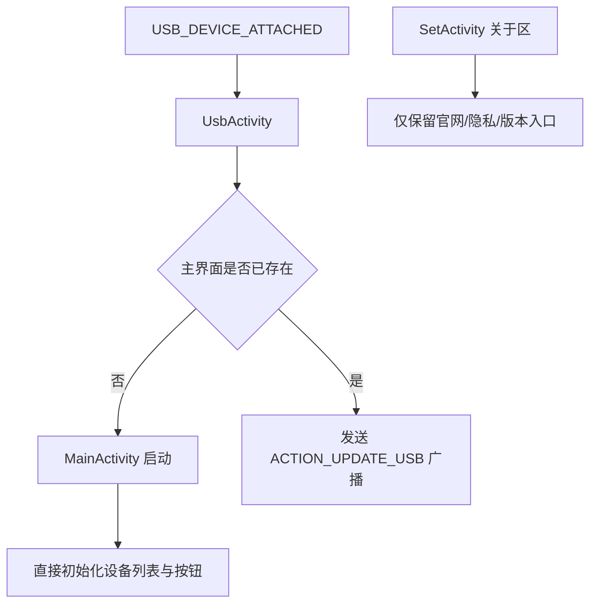

# 变更提案: remove_activation_logic

## 元信息
```yaml
类型: 重构
方案类型: implementation
优先级: P0
状态: 待实施
创建: 2026-03-11
负责人: pkg_keeper
模式: R2
关联任务包: 202603111355_remove-activation-logic
```

---

## 1. 需求

### 背景
当前应用把“激活/捐赠”放在主流程之前：`MainActivity.checkActive()` 会在首次进入时直接跳转到 `ActiveActivity`，`UsbActivity` 也依赖 `SharedPreferences("setting").getBoolean("isActive", false)` 决定是否允许 USB 入口继续执行。与此同时，`SetActivity` 的关于区暴露了“取消激活”入口，`ActiveActivity` 还依赖仓库中缺失的 `ActiveHelper`，导致现有工程同时存在使用门槛和编译风险。

### 目标
- 让用户首次进入应用时无需捐赠或激活即可直接使用主功能。
- 移除设置页、清单注册、独立页面和资源中的激活/捐赠入口。
- 尽量彻底移除 `ActiveHelper`、`isActive`、`activeKey` 等激活链路依赖，降低编译失败和残留死代码风险。
- 保持非激活相关功能（设备列表、设置页其他入口、USB 唤起主流程）行为不被额外改坏。

### 约束条件
```yaml
时间约束: 本次仅处理激活/捐赠链路，不扩展到无关设置项或 UI 重构
性能约束: 不引入额外启动耗时；主入口去门禁后仍保持现有初始化顺序
兼容性约束: 保留 MainActivity、UsbActivity、SetActivity 既有职责，不改变非激活功能入口
业务约束: 最终状态应体现“免费直接可用”，不得再出现强制激活、取消激活、捐赠激活文案或流程
```

### 验收标准
- [ ] 启动 `MainActivity` 时不再因未激活跳转到 `ActiveActivity`。
- [ ] `UsbActivity` 不再依赖 `isActive` 判定，USB 唤起能直接回到原主流程。
- [ ] 设置页关于区不再出现 `set_about_active` 对应入口，`AndroidManifest.xml` 不再注册 `.ActiveActivity`。
- [ ] 工程内不再存在对 `ActiveHelper`、`ActiveActivity`、`set_about_active`、`active_*` 激活资源的运行时引用。
- [ ] 激活链路删除后，至少完成一次残留引用扫描；条件允许时补充一次 app 模块编译验证。

---

## 2. 方案

### 技术方案
本次采用“移除激活链路”而不是“补齐缺失依赖”的收敛方案，按入口、设置/清单、实现/资源、验证四个面向落地：

1. **入口放开**
   - 删除 `MainActivity` 中的 `checkActive()` 调用及对应方法，保留原有 `AppData.init(this)` 之后的正常界面初始化。
   - 调整 `UsbActivity`，去掉 `SharedPreferences("setting")` 的 `isActive` 判断，让 USB 附着场景始终执行既有的“打开 MainActivity 或发送 USB 更新广播”逻辑。
2. **设置与清单清理**
   - 从 `SetActivity` 的关于区移除跳转 `ActiveActivity` 的卡片及无用 `Intent` 依赖。
   - 从 `easycontrol/app/src/main/AndroidManifest.xml` 删除 `.ActiveActivity` 注册，避免死页面继续暴露在清单中。
3. **实现与资源清理**
   - 删除 `ActiveActivity.java` 对 `ActiveHelper`、捐赠链接、激活/取消激活逻辑的引用；如该页面彻底无保留价值，则直接移除该类文件。
   - 删除 `res/layout/activity_active.xml`，同步清理 `values/strings.xml` 与 `values-en/strings.xml` 中 `set_about_active` 及 `active_*` 文案。
   - 清理 `Setting.java` 中仅服务于激活流程的 `getIsActive` / `setIsActive` / `getActiveKey` / `setActiveKey`，避免 SharedPreferences 残留无用键访问。
4. **残留引用验证**
   - 用全文检索确认 `ActiveHelper`、`ActiveActivity`、`isActive`、`activeKey`、`set_about_active`、`active_` 不再被主工程引用。
   - 条件允许时执行一次 `easycontrol` 工程的 app 模块编译验证，确认删除页面与资源后没有新的编译错误。

### 影响范围
```yaml
涉及模块:
  - easycontrol/app/src/main/java/top/saymzx/easycontrol/app/MainActivity.java: 去除首次启动激活跳转
  - easycontrol/app/src/main/java/top/saymzx/easycontrol/app/UsbActivity.java: 去除 USB 入口激活门禁
  - easycontrol/app/src/main/java/top/saymzx/easycontrol/app/SetActivity.java: 删除关于区激活入口
  - easycontrol/app/src/main/java/top/saymzx/easycontrol/app/ActiveActivity.java: 删除整页激活/捐赠实现与 ActiveHelper 依赖
  - easycontrol/app/src/main/java/top/saymzx/easycontrol/app/entity/Setting.java: 删除激活状态持久化访问器
  - easycontrol/app/src/main/AndroidManifest.xml: 移除 ActiveActivity 注册
  - easycontrol/app/src/main/res/layout/activity_active.xml: 删除激活页面布局
  - easycontrol/app/src/main/res/values/strings.xml: 删除中文激活/捐赠文案
  - easycontrol/app/src/main/res/values-en/strings.xml: 删除英文激活/捐赠文案
预计变更文件: 8-9
```

### 风险评估
| 风险 | 等级 | 应对 |
|------|------|------|
| 删除 `ActiveActivity` 后仍有隐藏引用，导致编译失败 | 高 | 以检索清单覆盖 Java、Manifest、layout、strings，并在末尾执行残留引用验证 |
| `UsbActivity` 去掉门禁后流程与现有广播分支不一致 | 中 | 仅保留原有“打开主页面/发送 USB 更新广播”逻辑，不额外改动广播行为 |
| `Setting.java` 删除激活访问器后仍被其他类调用 | 中 | 将 `Setting.java` 清理放在实现清理任务内，统一在残留扫描中核对 `getIsActive` / `getActiveKey` 等引用 |
| 删除字符串资源时误伤其他页面共用文案 | 低 | 仅移除 `set_about_active` 与 `active_*` 明确激活相关资源，不改动其他关于区条目 |

---

## 3. 技术设计（可选）

### 架构设计


---

## 4. 核心场景

> 执行完成后同步到对应模块文档

### 场景: 首次冷启动直接进入主界面
**模块**: `MainActivity`
**条件**: 新安装用户或本地不存在任何激活状态
**行为**: 启动应用后执行 `AppData.init(this)` 与主界面列表初始化，不再调用激活检测跳转
**结果**: 用户直接看到设备列表与设置入口，无需进入捐赠/激活页面

### 场景: USB 附着时直接进入既有连接流程
**模块**: `UsbActivity`
**条件**: 系统触发 `android.hardware.usb.action.USB_DEVICE_ATTACHED`
**行为**: `UsbActivity` 无条件执行已有主流程分支：主界面不存在时拉起 `MainActivity`，存在时发送 `ACTION_UPDATE_USB`
**结果**: USB 入口不再因为 `isActive=false` 被提前终止

### 场景: 设置页不再暴露激活/取消激活入口
**模块**: `SetActivity` / `strings.xml`
**条件**: 用户进入设置页的关于区
**行为**: 页面仅显示官网、隐私、版本等常规条目，去掉 `set_about_active` 文案与跳转
**结果**: 设置页不再出现激活相关操作或误导性入口

### 场景: 工程删除激活模块后仍可通过编译检查
**模块**: `ActiveActivity` / `AndroidManifest.xml` / `Setting.java` / 资源文件
**条件**: 激活页面、资源与持久化访问器已清理
**行为**: 执行残留关键字扫描，并在环境允许时运行 app 模块编译命令
**结果**: `ActiveHelper` 缺失不再造成当前任务范围内的显性编译障碍

---

## 5. 技术决策

> 本方案涉及的技术决策，归档后成为决策的唯一完整记录

### remove_activation_logic#D001: 采用“彻底移除激活链路”而不是补齐空壳激活实现
**日期**: 2026-03-11
**状态**: ✅采纳
**背景**: 当前产品目标是“首次进入无需捐赠即可直接使用”，而现有 `ActiveActivity` 既阻断主流程，又依赖仓库缺失的 `ActiveHelper`。如果仅补一个空壳 helper，会保留无意义页面、文案和状态位。
**选项分析**:
| 选项 | 优点 | 缺点 |
|------|------|------|
| A: 彻底移除激活链路（入口、页面、资源、偏好项） | 与产品目标完全一致；一并去除 `ActiveHelper` 编译风险；减少死代码与维护面 | 需要同步清理多处引用，改动面稍大 |
| B: 保留 `ActiveActivity`，仅补一个始终成功的 `ActiveHelper` | 改动路径短，表面上能恢复编译 | 仍保留捐赠/激活 UI 与状态位；首次体验仍受页面干扰；死代码继续存在 |
**决策**: 选择方案 A
**理由**: 当前需求不再需要任何激活概念，彻底删除比“保留空壳”更符合目标，也更能从根源上消除 `ActiveHelper` 缺失导致的构建障碍。
**影响**: 影响主入口、USB 入口、设置页关于区、激活页面源码、清单注册和中英文资源文件。
