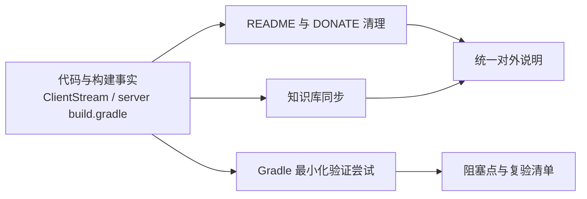

# 变更提案: cleanup_docs_build_validation

## 元信息
```yaml
类型: 优化
方案类型: implementation
优先级: P1
状态: 已规划
创建: 2026-03-11
更新: 2026-03-11
模式: R2
```

---

## 1. 需求

### 背景
- 当前开源代码已移除激活/捐赠限制，但 `README.md` 仍写有“官方打包的安装包需要激活”和“自行注释激活相关报错代码”等旧说明，`DONATE.md` 仍保留按订单号激活的软件使用流程，和现状不一致。
- `.helloagents/context.md` 与 `.helloagents/modules/repository_docs.md` 仍残留部分“激活/收费版”语义，需要同步回到当前开源仓库事实。
- `easycontrol/app/src/main/java/top/saymzx/easycontrol/app/client/tools/ClientStream.java` 通过 `R.raw.easycontrol_server` 读取被控端载荷；`easycontrol/server/build.gradle` 的 `copyDebug` / `copyRelease` 负责把 server APK 复制到 `easycontrol/app/src/main/res/raw/easycontrol_server.jar`。当前仓库中 `easycontrol/app/src/main/res/raw/` 尚不存在，因此需要结合本地验证澄清真实构建链路。
- 当前执行环境未检测到 `java`、`javac`、`sdkmanager`、`adb`，本地打包验证预期会遇到环境阻塞，必须如实记录而不是假定成功。

### 目标
- 清理 `README.md` 与 `DONATE.md` 中过时的激活/收费/手工注释说明，使其与当前开源代码行为一致。
- 同步 `.helloagents/context.md` 与 `.helloagents/modules/repository_docs.md`，确保知识库对仓库边界、文档职责和构建约束的描述准确。
- 进行一次最小化本地 Gradle 验证尝试，记录实际阻塞点、相关命令输出以及后续复验前提。
- 在方案包中明确 `easycontrol_server.jar` 产物链路、`raw/` 目录现状以及后续验证重点，避免后续执行阶段重复踩坑。

### 约束条件
```yaml
时间约束: 本次任务聚焦文档清理与构建验证记录，不扩展到功能代码重构
性能约束: 不改变 app/server 运行时逻辑，不新增运行时开销
兼容性约束: 文档必须以当前开源仓库为准，不能回退到已移除的激活/订单号流程
业务约束: 构建验证必须基于本地实际结果记录，禁止虚构“已成功打包”结论
```

### 验收标准
- [ ] `README.md` 与 `DONATE.md` 不再要求激活、订单号录入或手工注释已删除的激活代码，并改为当前开源版的使用/捐赠说明。
- [ ] `.helloagents/context.md` 与 `.helloagents/modules/repository_docs.md` 明确记录“当前开源版不含激活门控”和“构建验证依赖 server APK 复制到 `R.raw.easycontrol_server`”这一事实。
- [ ] 方案包记录构建前提检查结果（`java`/`javac`/`sdkmanager`/`adb`）与 Gradle 验证尝试命令、输出、阻塞点。
- [ ] 明确后续复验条件：补齐 JDK 与 Android SDK 后，重新验证 `:server:copyDebug` / `:server:copyRelease` 是否生成 `easycontrol/app/src/main/res/raw/easycontrol_server.jar`。

---

## 2. 方案

### 技术方案
1. **README / DONATE 清理**：删除对“官方安装包激活”“订单号录入”“自行注释激活报错代码”的旧描述，改为“当前开源仓库无需激活、捐赠不影响功能使用、构建需准备 Android/Gradle 环境”的统一说明。
2. **知识库同步**：更新 `.helloagents/context.md` 与 `.helloagents/modules/repository_docs.md`，把仓库边界从“激活/收费说明”调整为“开源版说明与可选捐赠支持”，并补充当前 server 产物链路与环境限制。
3. **构建验证记录**：先做本地工具前提检查，再在 `easycontrol/` 目录下执行 `sh ./gradlew :server:copyDebug --dry-run`，通过最小副作用方式确认 Gradle 启动链路是否可进入任务阶段；若失败，按实际输出记录阻塞点。
4. **产物链路核实**：以 `ClientStream.java` 和 `server/build.gradle` 为事实源，在方案包中明确 app 侧依赖 `R.raw.easycontrol_server`、server 侧通过 `copyDebug` / `copyRelease` 复制并重命名 APK、当前 `raw/` 目录缺失但尚未在完整环境中验证是否会被任务自动创建。

### 影响范围
```yaml
涉及模块:
  - repository_docs: 清理 README/DONATE 的用户可见说明，去除过时激活/收费叙述
  - knowledge_base: 同步 context 与 repository_docs 模块文档，修正文档职责和已知约束
  - easycontrol_app: 仅确认 ClientStream 对 R.raw.easycontrol_server 的资源依赖，不改动应用逻辑
  - easycontrol_server: 仅确认 copyDebug/copyRelease 的现有产物复制契约，不修改构建脚本
  - package_plan: 记录执行顺序、阻塞点、复验条件与技术决策
预计变更文件: 6
```

### 风险评估
| 风险 | 等级 | 应对 |
|------|------|------|
| 清理激活说明后，历史商业版/旧发布说明与当前仓库文档存在表述差异 | 中 | 所有文档统一限定为“当前开源仓库”视角，不对外部商业版行为做推断 |
| 当前环境缺少 JDK 与 Android SDK，Gradle 验证无法进入实际打包阶段 | 高 | 在方案包和执行日志中固化阻塞点，后续在完整 Android 环境补跑 `:server:copyDebug` / `:server:copyRelease` |
| `easycontrol/app/src/main/res/raw/` 当前缺失，真实复制行为尚未在完整环境中跑通 | 中 | 后续复验时重点检查目录是否自动创建、`easycontrol_server.jar` 是否落盘、app 编译是否能解析该资源 |

---

## 3. 技术设计（可选）

### 架构设计


### API设计
- 本次不涉及对外 API 变更。

### 数据模型
- 本次不涉及数据模型变更。

---

## 4. 核心场景

> 执行完成后同步到对应模块文档

### 场景: 开源用户阅读 README 获取构建说明
**模块**: repository_docs
**条件**: `README.md` 已清理旧激活/手工注释说明
**行为**: 用户查看“构建”或“使用”说明，确认当前开源仓库不需要激活，并获知构建依赖 Android/Gradle 环境。
**结果**: 用户不会再被过时的激活流程误导，也不会因为旧文档而尝试注释不存在的激活代码。

### 场景: 支持者阅读 DONATE 页面
**模块**: repository_docs
**条件**: `DONATE.md` 已从“订单号激活”改为“可选捐赠支持”描述
**行为**: 用户查看捐赠页面，了解捐赠是对项目的支持，而不是获取软件使用资格的前置条件。
**结果**: 捐赠页与当前开源版行为一致，不再形成付费激活误导。

### 场景: 维护者执行本地构建验证
**模块**: easycontrol_app / easycontrol_server
**条件**: 维护者准备执行 `:server:copyDebug` 或 `:server:copyRelease`
**行为**: 先检查 `java`、`javac`、`sdkmanager`、`adb` 等前提，再尝试运行 Gradle 验证命令，并结合 `ClientStream.java` / `server/build.gradle` 核对 `easycontrol_server.jar` 产物链路。
**结果**: 若环境不完整则能立即得到真实阻塞点；若环境完整则能继续验证 `easycontrol/app/src/main/res/raw/easycontrol_server.jar` 是否生成。

---

## 5. 技术决策

> 本方案涉及的技术决策，归档后成为决策的唯一完整记录

### cleanup_docs_build_validation#D001: 文档与知识库以当前开源代码事实为准
**日期**: 2026-03-11
**状态**: ✅采纳
**背景**: 当前代码已移除激活/捐赠限制，但用户文档和知识库仍保留旧收费/激活流程，导致仓库事实与说明分裂。
**选项分析**:
| 选项 | 优点 | 缺点 |
|------|------|------|
| A: 保留旧激活说明，仅在局部加“开源版已移除”注释 | 能保留历史背景信息 | 用户仍会看到订单号激活、手工注释等过时步骤，继续制造混淆 |
| B: 彻底改为“当前开源仓库无需激活”的统一说明 | 文档与代码一致，降低误导和维护成本 | 需要在多个文档位置同步修正旧术语 |
**决策**: 选择方案 B
**理由**: 本次任务目标是清理过时说明；既然当前仓库的运行事实已变化，就应让 README、DONATE 与知识库全部回到同一事实基线。
**影响**: `README.md`、`DONATE.md`、`.helloagents/context.md`、`.helloagents/modules/repository_docs.md`

### cleanup_docs_build_validation#D002: 在受限环境中采用“前提检查 + 最小化 Gradle 启动验证”记录真实阻塞点
**日期**: 2026-03-11
**状态**: ✅采纳
**背景**: 当前环境缺少 `java` / `javac` / `sdkmanager` / `adb`，不具备完整 Android 打包条件，但仍需要给出真实的本地验证结论。
**选项分析**:
| 选项 | 优点 | 缺点 |
|------|------|------|
| A: 不执行任何命令，仅根据经验写“环境不足，无法验证” | 成本最低 | 缺少一手命令输出，结论说服力弱 |
| B: 直接执行完整 `:server:copyDebug` / `:server:copyRelease` | 若环境齐全可直接得到完整结果 | 在当前环境必然失败，且可能引入不必要的副作用或额外下载 |
| C: 先检测前提，再用 `sh ./gradlew :server:copyDebug --dry-run` 进行最小化验证 | 能在不改文件权限、不制造产物的前提下拿到真实阻塞信息 | 无法替代完整环境下的最终打包验证 |
**决策**: 选择方案 C
**理由**: 该方式既保留了真实命令输出，又把工作区副作用降到最低，适合当前“先识别阻塞点、后续补环境复验”的目标。
**影响**: `tasks.md` 执行日志、后续构建复验流程、维护者本地验证指南
