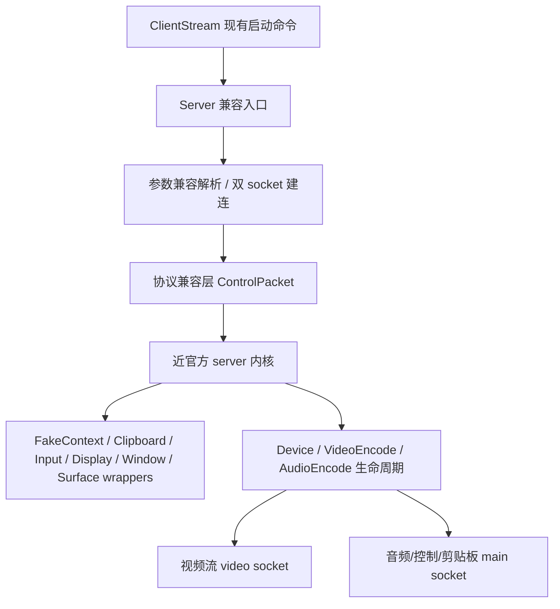

# 技术设计: scrcpy-v3.3.4-official-sync

## 技术方案
### 核心技术
- Android SDK / Java 8 / MediaCodec / AudioRecord / 反射系统服务包装器
- 以 **scrcpy v3.3.4** 为参考基线，同步其兼容性、生命周期和采集/控制结构
- 保留 Easycontrol 当前 `ClientStream` + 双 TCP socket + `ControlPacket` 的现有外部契约

### 实现要点
- 将迁移目标拆分为两层：
  1. **对外兼容壳层**：保留 `Server` 入口、参数格式、双 socket 建连、`ControlPacket` 指令和 raw 资源打包。
  2. **对内近官方内核**：在当前包名下吸收 scrcpy v3.3.4 的兼容性实现、生命周期清理策略、显示/输入/剪贴板包装器与媒体采集改进。
- 优先同步最接近 upstream 的兼容层：`FakeContext`、`InputManager`、`ClipboardManager`、`DisplayManager`、`WindowManager`、`SurfaceControl`。
- 对 `Server` / `Device` / `VideoEncode` / `AudioEncode` 做结构化重组，使其更接近 upstream 的职责划分，但不改变 app 侧既有协议。
- app 侧仅做兼容性改动：保持现有用户流程不变，同时提高对新版 server 初始化、协商和异常处理的容错。

### 上游基线与映射策略
- **上游基线固定方式:** 优先复用本地已存在的 `/tmp/scrcpy-upstream` 仓库；如不存在或未包含目标标签，则重新克隆官方 `https://github.com/Genymobile/scrcpy.git` 并固定到 `v3.3.4`。
- **当前已固定基线:** `scrcpy v3.3.4` → commit `fb6381f5b9bb96f3fa823d899f4c32de2ec84ab3`（来源: `/tmp/scrcpy-upstream`）
- **主要参考目录:** `server/src/main/java/com/genymobile/scrcpy/**`
- **类清单盘点范围:** 当前仓库的 `server/Server.java`、`entity/**`、`helper/**`、`wrappers/**` 与 upstream 的 `Server`、`Options`、`device/*`、`audio/*`、`control/*`、`wrappers/*`、`util/*`。
- **新增候选文件类型:** `util/Ln`、`util/IO`、`device/Size`、`device/Orientation`、`device/Position`、`audio/AudioDirectCapture`、`audio/AudioRawRecorder` 及可能新增的 wrapper 辅助类。是否真正引入，以 0.2 的类清单映射结果为准。
- **迁移原则:** 先明确“要修改哪些现有文件、要新建哪些适配文件、哪些 upstream 类只借逻辑不借结构”，再进入实际编码阶段。

#### 当前映射结果（0.2）
| 当前文件/模块 | scrcpy v3.3.4 参考来源 | 本轮策略 |
|---------------|------------------------|----------|
| `Server.java` | `Server.java`、`CleanUp.java`、`Workarounds.java` | 保留静态入口与双 socket，选择性吸收生命周期/清理逻辑 |
| `entity/Options.java` | `Options.java` | 保留现有启动参数集合，只吸收解析健壮性与兼容字段思路 |
| `entity/Device.java` | `device/Device.java`、`control/*`、`video/*` | 保留 Easycontrol 的扩展控制能力，选择性吸收新版显示/输入控制实现 |
| `entity/Pointer.java`、`entity/PointersState.java` | `control/Pointer.java`、`control/PointersState.java` | 以输入事件模型兼容为主 |
| `entity/DisplayInfo.java` | `device/DisplayInfo.java`、`device/Size.java` | 在保留当前字段访问方式基础上，补齐 flags / uniqueId / dpi 兼容信息 |
| `helper/FakeContext.java` | `FakeContext.java` | 优先完整吸收兼容性逻辑，并适配当前静态调用方式 |
| `helper/AudioCapture.java`、`helper/AudioEncode.java` | `audio/AudioCapture.java`、`AudioDirectCapture.java`、`AudioEncoder.java`、`AudioRawRecorder.java` | 保留当前主协议与协商字节格式，选择性吸收音频采集/编码兼容逻辑 |
| `helper/VideoEncode.java` | `video/SurfaceEncoder.java`、`ScreenCapture.java`、`NewDisplayCapture.java` | 保留当前视频 socket 封包格式，吸收新版编码/显示兼容处理 |
| `helper/ControlPacket.java` | 无直接同构类（与 `control/*` 仅职责相近） | 继续作为 Easycontrol 私有协议适配层保留 |
| `helper/EncodecTools.java` | `util/CodecUtils.java`（思路参考） | 保留本地能力探测实现，按需补齐新版兼容逻辑 |
| `wrappers/*` | `wrappers/*` | 优先同步最新版系统服务/显示兼容逻辑 |

- **无须直接镜像的 upstream 目录:** `device/DesktopConnection.java`、`control/ControlChannel.java`、`device/Streamer.java` 等官方连接协议实现，本轮只借内部思路，不直接落地到当前协议层。

### 参数兼容矩阵
| 参数键 | 当前 app 发送 | 当前 server 解析 | 本次决策 |
|--------|---------------|------------------|----------|
| `serverPort` | 是 | 是 | 保持不变 |
| `listenClip` | 是 | 否 | **server 新增兼容解析**，保持 app 启动命令不变 |
| `listenerClip` | 否 | 是 | 继续兼容，作为历史别名保留 |
| `isAudio` | 是 | 是 | 保持不变 |
| `maxSize` | 是 | 是 | 保持不变 |
| `maxFps` | 是 | 是 | 保持不变 |
| `maxVideoBit` | 是 | 是 | 保持不变 |
| `keepAwake` | 是 | 是 | 保持不变 |
| `supportH265` | 是 | 是 | 保持不变 |
| `supportOpus` | 是 | 是 | 保持不变 |
| `startApp` | 是 | 是 | 保持不变 |

### 协议基线表
#### 连接拓扑
- **main socket:** 控制输入、音频下行、剪贴板事件、视频尺寸事件、心跳保活
- **video socket:** 视频帧下行

#### main socket 入站控制协议（app → server）
| 类型 | 含义 | 负载 |
|------|------|------|
| `1` | 触摸事件 | `byte action + byte pointerId + float x + float y + int offsetTime` |
| `2` | 按键事件 | `int keyCode + int meta` |
| `3` | 剪贴板写入 | `int textLength + utf8Bytes` |
| `4` | 心跳保活 | 无 |
| `5` | 按比例改分辨率 | `float targetRatio` |
| `6` | 旋转请求 | 无 |
| `7` | 背光控制 | `byte mode` |
| `8` | 电源控制 | `int mode` |
| `9` | 按宽高改分辨率 | `int width + int height` |

#### main socket 出站事件（server → app）
| 类型 | 含义 | 负载 |
|------|------|------|
| `1` | 音频帧 | `int size + payload` |
| `2` | 剪贴板变更 | `int textLength + utf8Bytes` |
| `3` | 视频尺寸变更 | `int width + int height` |

#### video socket 出站帧格式（server → app）
- `int size`：总帧长度，**包含后续 `long pts` 的 8 字节**
- `long pts`
- `byte[size-8] payload`

#### 保活与超时
- app 通过 `type=4` 心跳包刷新 server 侧 `lastKeepAliveTime`
- server 保持当前“超时即断开”的语义，并在回归测试中显式验证心跳/超时行为

## 架构设计

## 架构决策 ADR
### ADR-001: 保留 Easycontrol 外部契约，内部向 scrcpy v3.3.4 同步
**上下文:** 用户明确要求保持现有启动命令、双 socket、`ControlPacket` 格式和 raw 打包方式不变，同时又要求把借鉴 scrcpy 的代码同步到最新版。
**决策:** 不直接嵌入官方 `scrcpy-server` 连接协议，而是在当前 `top.saymzx.easycontrol.server` 包下保留外部兼容入口，逐层吸收 v3.3.4 的内部实现与兼容性逻辑。
**理由:** 这能满足“尽量贴近最新版 scrcpy”与“绝不破坏当前主控端行为”两个目标。
**替代方案:** 全量切换到官方 `DesktopConnection` / `ControlChannel` / `Streamer` → 拒绝原因: 会破坏现有 app 侧连接方式与控制协议，超出用户约束。
**影响:** `Server`、`Options`、包装器、编码链路、app 侧连接容错都要同步重构。

### ADR-002: 以兼容层先行、核心链路后迁移的顺序实施
**上下文:** 当前 server 与 upstream 分叉时间较长，且 `FakeContext` / `ClipboardManager` / `DisplayManager` 等系统兼容点已显著落后。
**决策:** 先同步兼容层与生命周期基础设施，再迁移 `Device`、`VideoEncode`、`AudioEncode` 和 app 侧协商逻辑。
**理由:** 先收敛 Android 系统兼容差异，能降低后续媒体与控制链路重构时的变量数量。
**替代方案:** 直接重写媒体/控制主链路 → 拒绝原因: 故障面过大，难以定位协议与系统兼容问题。
**影响:** 任务拆分为“基线盘点 → 外部契约护栏 → 包装器/上下文 → server 内核 → app 适配 → 验证与文档”六段。

### ADR-003: Easycontrol 自定义控制能力通过协议适配层保留
**上下文:** 官方 scrcpy v3.3.4 不包含 Easycontrol 的分辨率切换、背光控制、电源控制等现有扩展协议。
**决策:** 保留当前 `ControlPacket` 指令集与编号，通过协议适配层把这些扩展能力继续路由到重构后的 server 内核。
**理由:** 这些行为是用户明确要求保留的验收项，也是当前 app UI 与交互流程的既有契约。
**替代方案:** 改为使用官方 scrcpy 控制协议 → 拒绝原因: 会导致 app 侧大量重写，且无法直接覆盖现有扩展能力。
**影响:** `ControlPacket`、`Server.executeControlIn()`、`Device` 的控制入口需要显式回归验证。

### ADR-004: 本轮迁移保留静态外壳边界，不在同一轮切换为完整实例化架构
**上下文:** 当前 `Server`、`ControlPacket`、`Device` 已通过静态字段/方法深度耦合；而 scrcpy v3.3.4 的 `DesktopConnection`、`Controller`、`Streamer` 等为实例化架构。
**决策:** 本轮迁移保持 `Server` 静态入口、`ControlPacket` 静态写流/读流边界与双 socket 现有拓扑，仅在内部吸收兼容逻辑和生命周期处理；不在本轮内全量切换到官方实例化连接模型。
**理由:** 这样可以把“兼容性同步”和“架构模式迁移”拆开，避免在一轮内同时改动连接协议、静态依赖关系和媒体链路。
**替代方案:** 直接迁移到官方实例化架构 → 拒绝原因: 会突破当前用户明确要求保留的对外契约，且耦合面过大。
**影响:** 任务 3.1 的目标是“在静态外壳内同步生命周期与参数模型”，而不是“直接复制官方实例化结构”。

## API设计
### 内部启动协议（保持不变）
- **请求:** `ClientStream` 继续执行现有 `app_process -Djava.class.path=... top.saymzx.easycontrol.server.Server ...` 启动命令，并传入当前 key=value 参数集。
- **响应:** server 继续通过现有 main/video 双 socket 提供媒体流、音频协商字节、视频尺寸事件、剪贴板事件与控制事件处理。

### 内部控制协议（保持不变）
- **请求:** app 继续发送当前 `ControlPacket` 定义的消息类型 `1-9`。
- **响应:** server 继续以当前 main/video 通道格式返回视频帧、音频帧、视频尺寸事件与剪贴板变更事件。

## 数据模型
- 无持久化模型变更。
- 运行期需要保持以下结构兼容：
  - 启动参数键集合：`serverPort` / `listenClip` / `listenerClip` / `isAudio` / `maxSize` / `maxFps` / `maxVideoBit` / `keepAwake` / `supportH265` / `supportOpus` / `startApp`
  - 参数兼容决策：`ClientStream` 保持发送 `listenClip`，server 同时兼容 `listenClip` 与 `listenerClip`
  - 控制协议编号：`1-9`
  - 视频帧格式：`[4-byte size(includes pts)][8-byte pts][payload]`
  - 音频与事件包格式：沿用当前 main socket 设计
  - 心跳保活：`type=4`

## 安全与性能
- **安全:**
  - 不引入未授权外部服务、生产连接或明文密钥。
  - 所有系统服务兼容改造仅限本地设备运行环境，不扩大权限边界。
  - 保留当前剪贴板、输入注入、电源控制路径时，显式处理 Android 新版系统签名与权限兼容。
- **性能:**
  - 避免无谓改变现有双 socket 数据面，优先优化 server 内部生命周期与编码链路。
  - 保持 H265/Opus 能力协商逻辑，避免因为内核升级导致带宽与延迟回退。
  - 对分辨率切换与编码器重建流程增加防抖/清理，避免反复创建资源导致崩溃或卡顿。

## 测试与部署
- **测试:**
  - 静态检查：代码编译一致性、参数与协议映射审计、知识库同步审计。
  - 阶段构建闸门：包装器同步完成后、server 内核重构完成后，各执行一次 `:server:compileDebugJavaWithJavac`（若环境缺失则明确记录阻断）。
  - 构建检查：在具备 Java / Android SDK 环境时执行 `./gradlew :server:assembleDebug :server:copyDebug :app:assembleDebug`。
  - 真机回归：验证投屏、触控、音频、剪贴板、分辨率切换、旋转、背光、电源控制、心跳超时、断线恢复。
- **部署:**
  - 继续沿用 `server` APK 复制为 `app/src/main/res/raw/easycontrol_server.jar` 的现有链路。
  - 在打包链路检查中同步确认 `aidl true` 所需资源与生成流程未被重构破坏。
  - 若 `server` 入口或参数兼容层发生变更，必须同步回归 `ClientStream` 的启动命令与推送流程。
